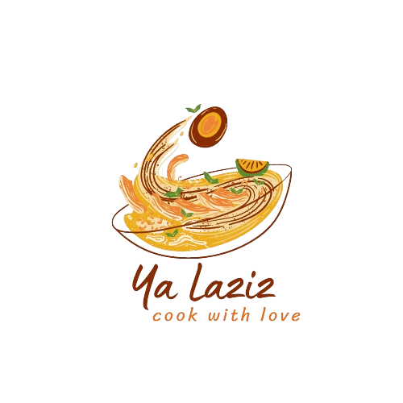

<h1 style="display: flex; align-items: center;">
     YaLaziz - Your Ultimate Recipe Platform!
</h1>

## Technologies Used

- **Front-end:** HTML, CSS, JavaScript
- **Back-end:** Django Framework
- **Version Control:** GitHub

## Features

- Create new recipes
- Edit or update recipes
- View and explore recipes
- Add recipes to favourites
- See the most viewed and newly added recipes on the main page
- Delete recipes

## Team Members

This project was a collaborative effort with an amazing team:

- Abanob Essam
- Michael Reda
- Marcelino Maximos
- Youssef Ehab
- Mariam Ayman
